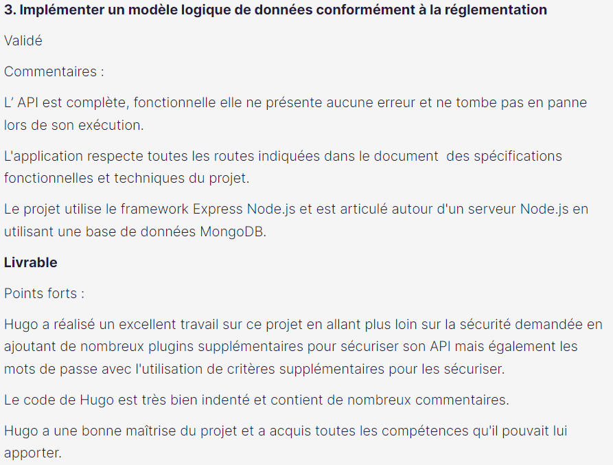
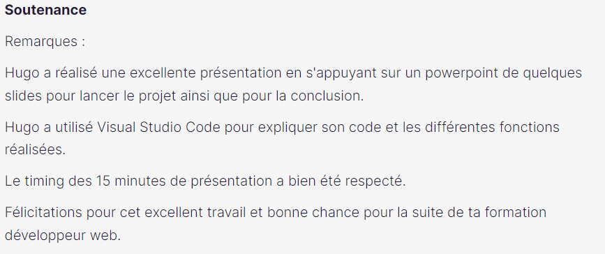

# Piiquante

Construire une API sécurisée à partir d'un frontend pré-établi

## Installation

A la racine du dossier frontend, lancez la commande _npm install_ pour installer Node.js

Dans le fichier .env.example du dossier backend :

- Indiquez les informations de connexion à une base de donnée MongoDB
- Ainsi qu'un token d'authentification
- Renommez le fichier .env

## Démarrage

Lancer le frontend avec _npm start_

Lancer le backend avec _nodemon server_ ou _node server_

## Évaluation

- Projet validé
- Commentaires :
  
  
  
