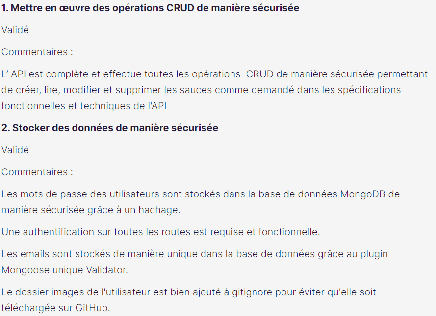

# Piiquante - Projet d'études

- https://hugo-de-yrigoyen.github.io/piiquante/
- Dans le cadre de mes études de développeur web
- API sécurisée construite à partir d'un frontend pré-établi en **JS uniquement** (pas d'autre language ou de framework autorisé)

## Contexte

- Instructions :
  https://s3.eu-west-1.amazonaws.com/course.oc-static.com/projects/DWJ_FR_P6/Requirements_DW_P6.pdf
- Frontend fourni :
  https://github.com/OpenClassrooms-Student-Center/Web-Developer-P6

## Installation

A la racine du dossier frontend, lancez la commande _npm install_ pour installer Node.js

Dans le fichier .env.example du dossier backend :

- Indiquez les informations de connexion à une base de donnée MongoDB
- Ainsi qu'un token d'authentification
- Renommez le fichier .env

## Démarrage

Lancer le frontend avec _npm start_

Lancer le backend avec _nodemon server_ ou _node server_

## Évaluation

- Projet validé
- Commentaires :
  
  
  
